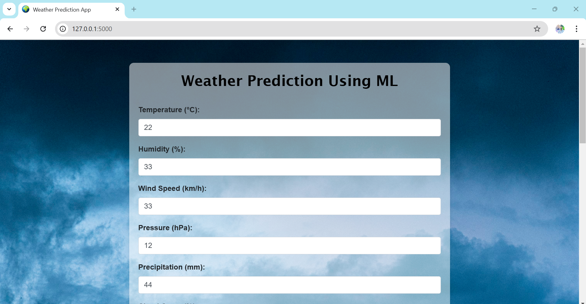
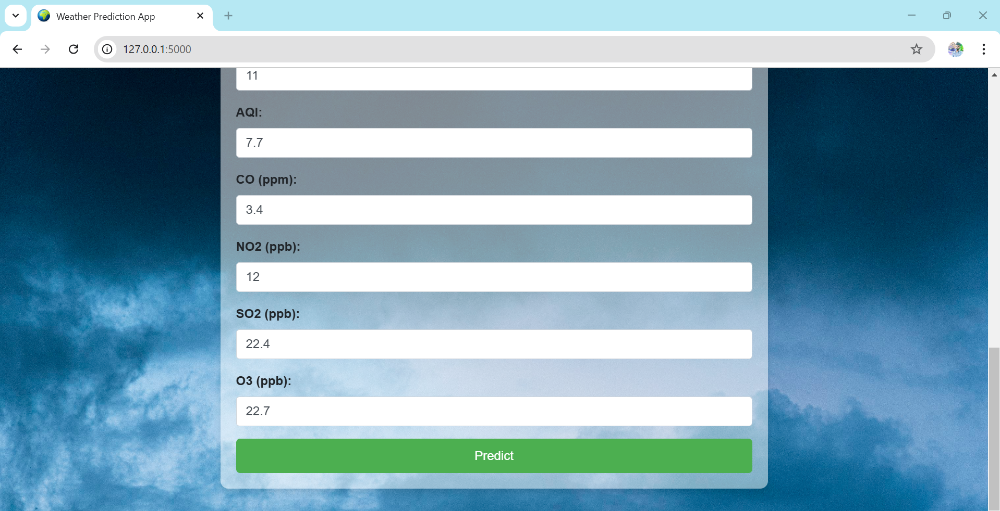

# 🌤️ Weather Prediction Using Flask Framework

This project predicts tomorrow's weather conditions using a **Support Vector Machine (SVM)** algorithm, implemented in Python and served via a **Flask** web application.

## 🚀 Features
- Predicts temperature probability of next day.
- Interactive and user-friendly Flask-based web interface.
- Uses historical weather data for predictions.
- Lightweight and easy to deploy.

## 🛠️ Technologies Used
- **Python**: Core programming language.
- **Flask**: Web framework for the frontend.
- **scikit-learn**: For implementing the SVM algorithm.
- **HTML/CSS**: Frontend design.
- **Pandas**: For data manipulation.
- **NumPy**: For numerical computations.

## 📂 Project Structure
Weather Prediction Using Flask Framework/ 

🌟 Screenshots

### **Home Page**

### **Prediction Page**

📊 Machine Learning Model

Algorithm: Support Vector Machine (SVM).
Training Data: Based on historical weather data (e.g., temperature, humidity, wind speed).
Accuracy: Achieved ~ 95% accuracy during testing.

🛡️ Future Enhancements
Add real-time weather data integration.
Deploy on cloud platforms like Heroku or AWS.
Support for additional weather metrics (e.g., air quality).

🤝 Contributing
Fork the repository.

📄 License
This project is licensed under the MIT License.

✨ Acknowledgments
Inspired by real-world weather prediction systems.
